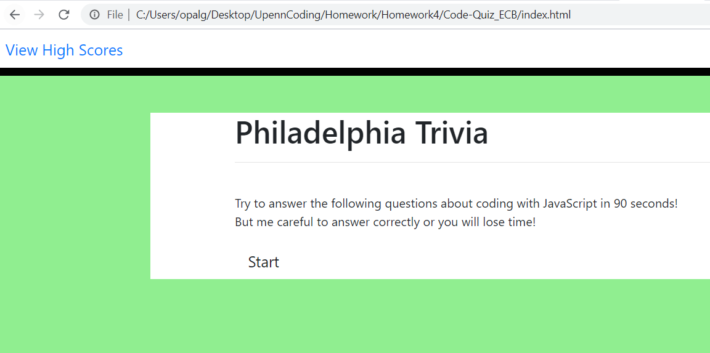
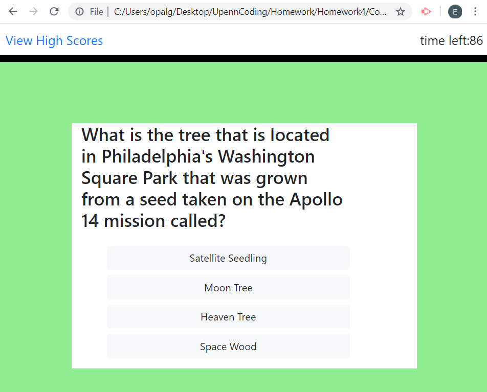
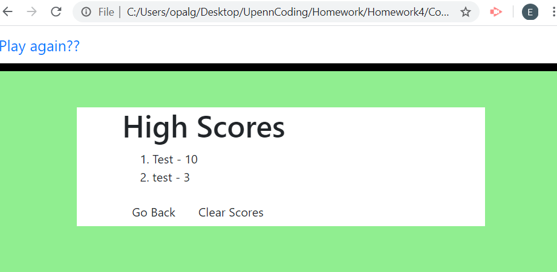
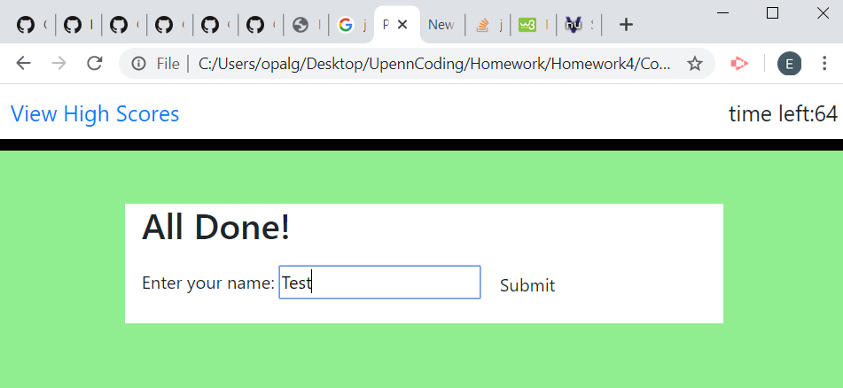

# Code-Quiz_ECB
This is a quiz about Philadelphia.

# This is where I started

I started with the index.html and the formatting of the header. I quickly finished this and went on to trying to figure out how to make the quiz questions appear on the page. 

# The hardest part

The hardest part was actually getting the quiz questions to appear. I head accidentaly had a no-display in my css which took a while to trouble shoot. 

# Finishing up

To wrap things i worked on the high score page and had it sort the scores numericaly from high to low. 

# Still working on.

I would like the high score page to only display the top ten scores.

# Helpful hands

I took alot of help from Laurie Bernadel's for a code quiz. 
https://github.com/lbernadel 

